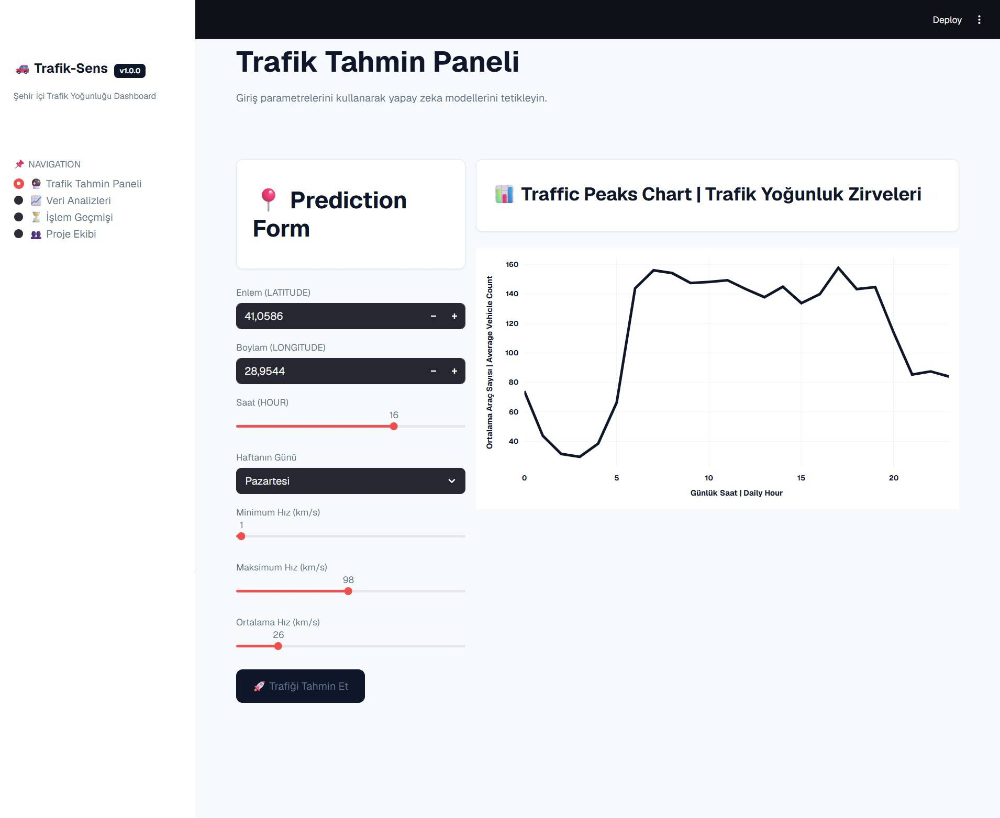
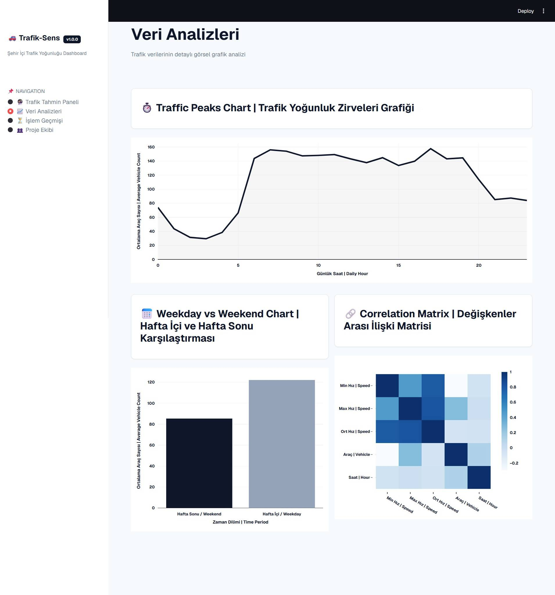

# Istanbul Traffic Density Prediction System 🚗📊

Language Options / Dil Seçenekleri: [English (Current)](README.md) | [Türkçe](README_TR.md)

An end-to-end Machine Learning decision support system designed to classify city traffic density levels ("Low", "Medium", "High") and predict the exact vehicle counts dynamically based on time and spatial coordinates using Istanbul Metropolitan Municipality (IBB) Open Data.

## 📌 Project Overview
- **Objective:** Developing a hybrid data solution to predict city traffic metrics to assist urban planning and routing algorithms.
- **Methodology:** Scrum Framework (4 Sprints managed via Trello).
- **Dataset:** ~15,000 processed rows sampled from millions of historical IBB traffic sensor logs (October 2024).
- **Production Conversion:** Python models exported via `pickle` and served through a modular responsive Web Dashboard built with **Streamlit**.

## 📂 Modular Architecture (Separation of Concerns)
To follow industry-standard software engineering practices, the backend logic is decoupled into a structured `utils` package:
- `src/utils/charts.py`: Dynamic time-series trends and mathematical feature importance correlation matrix rendered with Plotly.
- `src/utils/styles.py`: UI/UX styling sheet injecting a custom corporate theme, Geist typography, and adaptive container layout rules.
- `src/app.py`: Main application layer managing local cache pipelines (`@st.cache_resource`), model execution state, and live query history log streaming (`st.session_state`)

## 👥 Team & Roles
- **Muhammet Mustafa Mencik:** Team Lead / Data Preprocessing
- **Kağan Aydın:** Data Analyst / Exploration & Graphics Motor Design
- **Baran Demir:** ML Developer / Model Training
- **Mehmet Açıkgöz (Me):** UI & Software Engineer / Dashboard Structural Architecture & Absolute Path Data Controls.

## 🛠️ Tech Stack & Requirements
- **Languages/Tools:** Python, Streamlit, Git, GitHub Desktop
- **Libraries:** Pandas, NumPy, Scikit-Learn, XGBoost, Plotly

## 🧠 Machine Learning Performance
- **Classification (Traffic Density State):** Random Forest Classifier -> **78.50% Accuracy**
- **Regression (Exact Vehicle Prediction):** Random Forest Regressor -> **MAE: ~54 vehicles**

## 🖥️ Application Screenshots

### Traffic Prediction Panel & Live ML Simulation Results

### Data Analytics & Interactive Plotly Charts

### State Logs & Query History Infrastructure

### Project Team & Scrum Roles Presentation
